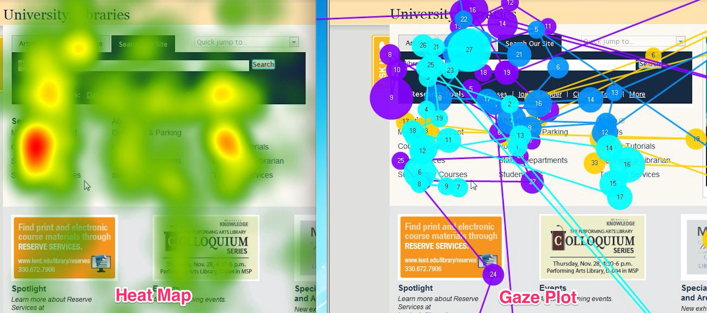

# W1 - Make me an interactive map

 
# Overview 

**Jakob Grøhn Damgaard, Januray 2021**  
This repository contains the W1 assigmnent for the course *Spatial Analytics*

# Task 1 - Example of a research problem
An field of study which implements methods and principles from spaital analysis, but does not revolve around geographic data, is eye tracking. An example of a specific eye tracking research area where spatial analysis would be to investigate visual attention behavior in children when interacting with screen technology, e.g. tablets.

# Task 2 - Potential data layers
Depending on the specific research question, multiple data layers could be beneficial to implement both in order to aid visualizations and for use in statistical analysis. These layers would be mapped onto the image appearing on the screen the child is viewing and, thus, the scale of the data remains fixed to this area. Examples of such layers include:
  
1. Areas of Interest (AOIs) - *Polygon* 
2. Saccade paths - *Polylines* 
3. Fixation points - *Points* 
4. Visual attention distribution heatmap - *Raster layer* 
5. Microsaccade paths - *Polylines* (Provides higher resolution of eye movements during fixation but is rarely used in behavioural research)
 
 All these data layers are obtained (thoug data pre-processing may be required) when running experiments using modern eye tracking technology. Specified polygons may be implemented to outline certain areas of interest (AOIs). Adding suchg demarcations could allow for conducting statistical analyses of e.g. amount of time children soend looking at various areas of the screen. Adding saccade paths would enable the researcher to track the temporal order of the changes in visual attention. Adding fixation points would be able to represent points where the child's visual attention remains fixated for a certain amount of times. An extra attribute could be added to these points by seting the size of the symbol according to the length of the fixation. Instead of adding the above polygon/polyline/point layers, the child's visual attention could also be analyzed by mapping the distribution of visual attention across the screen using a raster layer. This would result in a visually pleasing heatmap. The image below shows different data layers added to an analyzed screen.
  

### Example of different data layers applied to the same baselayer

 
Source: https://medium.com/@TheRealTang/subtleties-of-eyetracking-heat-maps-and-gaze-plots-a7ba4207f20f
 

# Task 3 - Creating an interactive map 
The script containg code for producing the map can be found in the file *W1-Interactive-Map.R*. The final html map can be found be clicking the file *Interactive-Map.html*.

# License

Shield: [![CC BY-SA 4.0][cc-by-sa-shield]][cc-by-sa]

This work is licensed under a
[Creative Commons Attribution-ShareAlike 4.0 International License][cc-by-sa].

[![CC BY-SA 4.0][cc-by-sa-image]][cc-by-sa]

[cc-by-sa]: http://creativecommons.org/licenses/by-sa/4.0/
[cc-by-sa-image]: https://licensebuttons.net/l/by-sa/4.0/88x31.png
[cc-by-sa-shield]: https://img.shields.io/badge/License-CC%20BY--SA%204.0-lightgrey.svg

